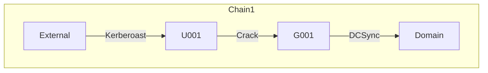
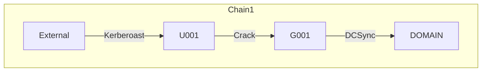

# AD SUITE - COMPLETE END-TO-END SYSTEM FLOW DOCUMENTATION (PART 2)

## CONTINUATION FROM PART 1

This document continues the comprehensive end-to-end analysis of the AD Suite project, covering all remaining pages, backend APIs, database operations, and complete data flows.

---

## 4. SCANS PAGE - SCAN LIST & ENTITY GRAPH VISUALIZATION

### 4.1 PAGE OVERVIEW
**File**: `AD-Suite-Web/frontend/src/pages/Scans.tsx`

The Scans page provides two views:
1. **Table View**: List of all scans with metadata
2. **Graph View**: Entity relationship graph visualization from scan findings

### 4.2 DATA SOURCES

#### Scan List Query
```typescript
useQuery({
    queryKey: ['scans-list'],
    queryFn: async () => (await api.get('/scans')).data as ScanSummary[]
})
```

**API Endpoint**: `GET /api/scans`
**Backend Route**: `AD-Suite-Web/backend/src/routes/scans.ts`
**Controller**: `ScanController.getScans()`
**Service**: `ScanService.listAvailableScans()`

**Data Flow**:
1. Frontend sends GET request to `/api/scans`
2. Backend scans two directories:
   - `uploads/analysis/` - Uploaded JSON files
   - `out/` - Generated scan results (scan-results.json in subdirectories)
3. For each file, backend reads and parses JSON
4. Extracts metadata: timestamp, totalFindings, globalRiskBand, severity counts
5. Returns array of ScanSummary objects
6. Frontend stores in React Query cache
7. Renders table or populates dropdown


#### Scan Detail for Graph Query
```typescript
useQuery({
    queryKey: ['scan-detail-for-graph', selectedScanId],
    queryFn: async () => (await api.get(`/scans/${encodeURIComponent(selectedScanId)}`)).data,
    enabled: view === 'graph' && Boolean(selectedScanId)
})
```

**API Endpoint**: `GET /api/scans/:id`
**Backend**: `ScanController.getScan()`
**Service**: `ScanService.getScanContent(id)`

**Data Flow**:
1. User selects scan from dropdown
2. Frontend sends GET request with scan ID
3. Backend finds scan file by ID or filename
4. Reads and parses complete JSON document
5. Returns full scan document with results[], meta, aggregate
6. Frontend processes findings to extract entity graph

### 4.3 TABLE VIEW RENDERING

**Columns Displayed**:
- Name (clickable link to ScanDetail page)
- Status (Complete/Warning/Error badge with icon)
- Risk (Critical/High/Medium/Low colored text)
- Findings (total count)
- Time (timestamp with Clock icon)

**Row Rendering Logic**:
```typescript
filtered.map((scan) => (
    <tr key={scan.path || scan.id} className="hover:bg-bg-hover">
        <td><Link to={`/scans/${encodeURIComponent(scan.id)}`}>{scan.name}</Link></td>
        <td><StatusBadge status={scan.status} /></td>
        <td className={riskColor}>{scan.globalRiskBand}</td>
        <td>{scan.totalFindings}</td>
        <td>{new Date(scan.timestamp).toLocaleString()}</td>
    </tr>
))
```


### 4.4 GRAPH VIEW - ENTITY RELATIONSHIP VISUALIZATION

#### Graph Data Extraction Pipeline

**Step 1: Extract Scan Results**
```typescript
const checks = extractScanResultsArray(selectedScanDetail);
```
- Normalizes different JSON schemas
- Handles `results[]`, `checks[]`, `Results[]`, `Checks[]`
- Returns array of check objects

**Step 2: Flatten Finding Rows**
```typescript
const rows = flattenFindingRows(checks);
```
- Each check may have nested `Findings[]` array
- Flattens to individual finding rows
- Preserves parent check metadata (CheckId, CheckName, Severity)

**Step 3: Extract Entity Graph**
```typescript
const graph = extractEntityGraphFromFindings(rows, { domainLabel: domain });
```

**File**: `AD-Suite-Web/frontend/src/lib/extractEntityGraph.ts`

**Entity Extraction Logic**:
- Scans finding rows for entity columns: User, Computer, Group, OU, GPO, Template, CA, SPN
- Creates nodes for each unique entity
- Creates edges based on relationships:
  - User → Group (MemberOf)
  - Computer → OU (Location)
  - GPO → OU (LinkedTo)
  - User → SPN (ServicePrincipalName)
  - Template → CA (IssuedBy)

**Graph Structure**:
```typescript
{
    nodes: [
        { id: 'U:john.doe', label: 'john.doe', type: 'user', severity: 'high', findingCount: 3 },
        { id: 'G:Domain Admins', label: 'Domain Admins', type: 'group', severity: 'critical', findingCount: 5 }
    ],
    edges: [
        { source: 'U:john.doe', target: 'G:Domain Admins', label: 'MemberOf', findingIds: ['ACC-025'] }
    ]
}
```


#### Graph Rendering with Sigma.js

**Component**: `ScanEntityGraph.tsx`
**Library**: Sigma.js (WebGL-based graph rendering)

**Rendering Pipeline**:
1. Create Sigma instance with canvas container
2. Add nodes with positions (force-directed layout)
3. Add edges with colors based on severity
4. Apply node sizing based on findingCount
5. Enable interactions: hover, click, drag
6. Render legend showing node types

**Node Styling**:
- User: Blue circle
- Computer: Green square
- Group: Orange hexagon
- OU: Purple rectangle
- GPO: Red diamond
- Domain: Large yellow circle (center)

**Edge Styling**:
- Critical findings: Red thick line
- High findings: Orange medium line
- Medium findings: Yellow thin line
- Low findings: Blue dotted line

**Interactions**:
- Hover: Highlight node and connected edges
- Click: Show finding details in sidebar
- Drag: Reposition nodes
- Zoom: Mouse wheel
- Pan: Click and drag background

**Fullscreen Mode**:
- Button triggers `element.requestFullscreen()`
- Graph expands to fill entire screen
- Exit with ESC key or button
- Maintains graph state during transition

### 4.5 FILE UPLOAD FUNCTIONALITY

**Upload Flow**:
1. User clicks "Upload JSON" button
2. File input opens
3. User selects scan-results.json file
4. Frontend reads file with FileReader
5. Sends multipart/form-data POST to `/api/analysis/upload`
6. Backend validates JSON structure
7. Saves to `uploads/analysis/` with timestamp prefix
8. Returns filename
9. Frontend refetches scan list
10. Automatically selects uploaded scan in graph view


---

## 5. SCAN DETAIL PAGE - INDIVIDUAL SCAN VIEW

### 5.1 PAGE OVERVIEW
**File**: `AD-Suite-Web/frontend/src/pages/ScanDetail.tsx`

Displays detailed information about a single scan with export options.

### 5.2 DATA LOADING

**Query**:
```typescript
useQuery({
    queryKey: ['scan-detail', scanId],
    queryFn: async () => (await api.get(`/scans/${encodeURIComponent(scanId)}`)).data
})
```

**API Endpoint**: `GET /api/scans/:id`
**Returns**: Complete scan document with meta, aggregate, results[]

### 5.3 PAGE SECTIONS

#### Metric Cards (3 cards)
1. **Global Risk**: `aggregate.globalRiskBand` (Critical/High/Medium/Low)
2. **Findings (rows)**: Count of results array length
3. **Total Findings (aggregate)**: `aggregate.totalFindings` (sum of all FindingCount)

#### Metadata Section
- Displays `meta` object as formatted JSON
- Shows scan configuration, domain info, timestamps
- Scrollable with max-height

#### Aggregate Section
- Displays `aggregate` object as formatted JSON
- Shows checksRun, checksWithFindings, checksWithErrors
- Shows severity breakdown, category scores
- Scrollable with max-height

### 5.4 EXPORT FUNCTIONALITY

**Export JSON**:
```typescript
await downloadAuthenticated(
    `scans/${encodeURIComponent(scanId)}/export/json`,
    `AD_Suite_Scan_${scanId}.json`
);
```

**Export CSV**:
```typescript
await downloadAuthenticated(
    `scans/${encodeURIComponent(scanId)}/export/csv`,
    `AD_Suite_Scan_${scanId}.csv`
);
```

**Backend Export Flow**:
1. Frontend calls `/api/scans/:id/export/:format`
2. Backend reads scan file
3. For JSON: Returns file directly
4. For CSV: Converts findings to CSV format
5. Sets Content-Disposition header for download
6. Browser downloads file


**CSV Conversion Logic** (`scanExportCsv.ts`):
1. Extract all findings from results[]
2. Flatten nested Findings[] arrays
3. Determine all unique column names
4. Generate CSV header row
5. Generate data rows with proper escaping
6. Handle special characters, quotes, commas
7. Return CSV string

---

## 6. ANALYSIS PAGE - SCAN ANALYSIS DASHBOARD

### 6.1 PAGE OVERVIEW
**File**: `AD-Suite-Web/frontend/src/pages/Analysis.tsx`

Comprehensive analysis dashboard for loading and analyzing scan results with filtering, sorting, and drill-down capabilities.

### 6.2 DATA LOADING OPTIONS

#### Option 1: Load Local File
- User clicks "Load scan results" button
- File input opens
- User selects JSON file
- FileReader reads file content
- Parses JSON and normalizes schema
- Stores in component state
- Does NOT upload to server

#### Option 2: Upload to Server
- User clicks "Upload & save to server"
- File input opens
- User selects JSON file
- Sends multipart/form-data POST to `/api/analysis/upload`
- Backend validates and saves to `uploads/analysis/`
- Also loads locally for immediate viewing

#### Option 3: Load from Server Files
- User clicks "Server files" button
- Fetches list from `/api/analysis/scans`
- Displays table of uploaded files
- User clicks "Load" button
- Fetches file content from `/api/analysis/scans/:filename`
- Parses and displays

#### Option 4: Load Registered Scan
- User clicks "Registered scans" button
- Fetches list from `/api/reports/scans`
- Displays dropdown of all scans (uploads + out/)
- User selects scan and clicks load
- Fetches content from `/api/analysis/scans/:id`
- Parses and displays


### 6.3 SCHEMA NORMALIZATION

**Function**: `normalizeScanDoc(raw)`

Handles multiple JSON schema variations:
- `results[]` vs `Results[]` vs `checks[]` vs `Checks[]`
- `aggregate` vs `Aggregate`
- `meta` vs `Meta`
- Nested `data.results` or `scan.results`
- PascalCase vs camelCase field names

**Normalization Process**:
1. Detect schema structure
2. Extract results array using `extractScanResultsArray()`
3. Normalize each result object to PascalCase:
   - CheckId, CheckName, Category, Severity
   - Result, FindingCount, CheckScore, DurationMs
   - Error, Description, Remediation, References
   - Findings[], SourcePath, ScoreWeight
4. Return standardized ScanDocument object

### 6.4 STATISTICS CARDS (4 cards)

**Data Source**: `scanDoc.aggregate`

1. **Checks Run**: `aggregate.checksRun` or `meta.checksRun`
2. **Global Score**: `aggregate.globalScore` (0-100)
3. **Risk Band**: `aggregate.globalRiskBand` (Critical/High/Medium/Low)
4. **Total Findings**: `aggregate.totalFindings`

**Card Styling**:
- Icon with colored background
- Large value text
- Hover shadow effect
- Responsive grid layout

### 6.5 FILTERING SYSTEM

#### Category Filter
- Extracts unique categories from results[]
- Displays as clickable chips
- "All Categories" chip to clear filter
- Active chips highlighted in orange
- Multiple categories can be selected

#### Severity Filter
- Extracts unique severities from results[]
- Normalizes to lowercase
- Displays as clickable chips
- "All Severities" chip to clear filter
- Active chips highlighted in orange
- Multiple severities can be selected

**Filter Application**:
```typescript
let rows = results;
if (filterCats.size > 0) rows = rows.filter(r => filterCats.has(r.Category));
if (filterSevs.size > 0) rows = rows.filter(r => filterSevs.has(r.Severity.toLowerCase()));
```


### 6.6 SORTING SYSTEM

**Sortable Columns**:
- CheckId
- CheckName
- Category
- Severity
- Result
- FindingCount
- CheckScore
- DurationMs

**Sort Logic**:
```typescript
rows.sort((a, b) => {
    const va = a[sortKey] ?? '';
    const vb = b[sortKey] ?? '';
    if (typeof va === 'number' && typeof vb === 'number') 
        return (va - vb) * sortDir;
    return String(va).localeCompare(String(vb), undefined, { numeric: true }) * sortDir;
});
```

**Sort Direction**:
- Click column header to sort ascending (1)
- Click again to sort descending (-1)
- ChevronUp/ChevronDown icon indicates direction

### 6.7 RESULTS TABLE

**Columns**:
1. CheckId (sortable, monospace font)
2. Check Name (sortable)
3. Category (sortable)
4. Severity (sortable, colored badge)
5. Result (Pass/Fail/Error badge)
6. Findings (sortable, count)
7. Score (sortable, numeric)
8. Duration (sortable, milliseconds)
9. Details (drill-down button)

**Row Rendering**:
- Alternating row colors
- Hover highlight
- Severity color coding
- Result status badges
- Responsive padding based on table density setting

### 6.8 DRILL-DOWN DETAILS

**Component**: `DrillDown({ result })`

**Expandable Content**:
1. **Description**: Check description text
2. **Remediation**: Remediation guidance
3. **References**: Links to documentation (clickable with ExternalLink icon)
4. **Error**: Error message if check failed
5. **Findings Preview**: First 15 finding rows in table

**Findings Table**:
- Dynamically generates columns from finding object keys
- Excludes metadata columns (CheckId, CheckName, etc.)
- Shows first 10 columns only
- Truncates long values
- Scrollable with max-height
- Hover row highlight


### 6.9 TOP 10 HIGHEST RISK CHECKS

**Data Source**: Results sorted by CheckScore descending, top 10

**Display**:
- Compact list view
- CheckId + CheckName
- CheckScore value
- Severity badge
- Category label
- Scrollable container

### 6.10 GLOBAL STATE INTEGRATION

**Zustand Stores**:

1. **useAppStore** (scan history):
```typescript
addScanHistory({
    id: scanId,
    timestamp: Date.now(),
    totalFindings: doc.aggregate.totalFindings,
    durationMs: 0,
    status: 'success'
});
setActiveScanId(scanId);
```

2. **useFindingsStore** (findings cache):
```typescript
setFindings(scanId, doc.results.flatMap(r => r.Findings || []));
```

**IndexedDB Persistence**:
- Scan history persisted to IndexedDB
- Findings cached in IndexedDB
- Survives page refresh
- Enables offline analysis

### 6.11 EXPORT FILTERED RESULTS

**Button**: "Download Filtered"

**Export Logic**:
```typescript
const out = {
    schemaVersion: 1,
    filteredFrom: scanDoc.meta,
    aggregate: scanDoc.aggregate,
    results: filtered
};
const blob = new Blob([JSON.stringify(out, null, 2)], { type: 'application/json' });
```

**Download**:
- Creates blob URL
- Triggers browser download
- Filename: `scan-filtered.json`
- Includes only filtered results
- Preserves original metadata


---

## 7. ATTACK PATH PAGE - AI-POWERED ATTACK PATH ANALYSIS

### 7.1 PAGE OVERVIEW
**File**: `AD-Suite-Web/frontend/src/pages/AttackPath.tsx`

AI-powered analysis that generates attack paths, kill chains, choke points, and remediation recommendations using LLM providers (OpenAI, Anthropic, Ollama).

### 7.2 CONFIGURATION PANEL

#### Data Source Selection

**Option 1: Server Scan**
- Dropdown populated from `/api/reports/scans`
- Fetches findings from `/api/reports/scans/:id/findings`
- Returns flattened finding rows

**Option 2: Local File Upload**
- File input for JSON upload
- FileReader parses locally
- Extracts findings using `extractScanResultsArray()`
- No server upload

#### Severity Filter
- Checkboxes for Critical, High, Medium, Low
- Default: Critical + High selected
- Filters findings before sending to LLM
- Reduces token usage and improves focus

#### LLM Provider Configuration

**Ollama (Local)**:
- No API key required
- Default model: llama3
- Endpoint: http://localhost:11434/api/generate
- Free, private, offline

**OpenAI**:
- Requires API key
- Default model: gpt-4o-mini
- Endpoint: https://api.openai.com/v1/chat/completions
- JSON mode enabled
- Paid service

**Anthropic**:
- Requires API key
- Default model: claude-3-haiku-20240307
- Endpoint: https://api.anthropic.com/v1/messages
- System prompt + user message
- Paid service


### 7.3 TOKENIZATION & REDACTION (PRIVACY GATEWAY)

**Purpose**: Protect sensitive entity names before sending to external LLM APIs

**Process** (`llmTokenize.ts`):

1. **Build Token Maps**:
```typescript
const maps = buildTokenMaps(rawFindingObjs);
```
- Scans all findings for entity columns: User, Computer, Group, OU, GPO, Template, CA, SPN
- Creates bidirectional mapping:
  - `realToToken`: { "john.doe": "U001", "DC01": "C001" }
  - `tokenToEntry`: { "U001": { real: "john.doe", type: "user" } }

2. **Tokenize Findings**:
```typescript
const tokenized = rawFindingObjs.map(f => tokenizeFinding(f, maps));
```
- Replaces real entity names with tokens
- User: U001, U002, U003...
- Computer: C001, C002, C003...
- Group: G001, G002, G003...
- Template: T001, T002...
- GPO: GPO001, GPO002...
- OU: OU001, OU002...
- CA: CA001, CA002...
- SPN: SPN001, SPN002...

3. **Deep Redaction**:
```typescript
const redacted = deepRedact(tokenized);
```
- Removes PII fields: Email, Phone, Address
- Truncates long text fields
- Preserves structure for LLM analysis

4. **Send to LLM**:
- Tokenized + redacted findings sent to API
- LLM never sees real entity names
- Privacy preserved even with external APIs

5. **Detokenize Response**:
```typescript
data.executiveSummary.text = detokenizeText(data.executiveSummary.text, maps);
```
- Replaces tokens back to real names in response
- User sees real entity names in UI
- Token map displayed for audit/debug


### 7.4 ATTACK PATH PAYLOAD BUILDING

**File**: `AD-Suite-Web/backend/src/utils/attackPathPayload.ts`

**Function**: `buildAttackPathPayload(findings)`

**Process**:
1. **Group by CheckId**: Combine findings from same check
2. **Tier Classification**: Assign tier based on severity and category
   - Tier 0: Critical domain-level (KRBTGT, Domain Admins, GPO)
   - Tier 1: High-risk servers (DCs, ADCS CAs)
   - Tier 2: Medium-risk workstations
   - Tier 3: Low-risk users
3. **Deduplication**: Remove duplicate entity references
4. **Sampling**: Limit samples per check to reduce token usage
5. **Budget Enforcement**: Truncate if exceeds character limit
6. **JSON Generation**: Create structured payload for LLM

**Payload Structure**:
```json
{
  "tier0": [
    {
      "checkId": "ACC-025",
      "checkName": "Privileged Group Membership",
      "severity": "Critical",
      "category": "Access Control",
      "samples": [
        { "Entities": ["U001", "G001"], "Evidence": "MemberOf" }
      ]
    }
  ],
  "tier1": [...],
  "tier2": [...],
  "tier3": [...]
}
```

### 7.5 LLM ANALYSIS REQUEST

**API Endpoint**: `POST /api/attack-path/analyze`

**Request Body**:
```json
{
  "findings": [...tokenized findings...],
  "llmProvider": "openai",
  "model": "gpt-4o-mini",
  "apiKey": "sk-..."
}
```

**Backend Processing**:
1. Receive tokenized findings
2. Build attack path payload
3. Generate system prompt (instructions for LLM)
4. Generate user prompt (payload + context)
5. Call LLM API based on provider
6. Parse JSON response
7. Return structured analysis


### 7.6 ANALYSIS RESPONSE STRUCTURE

**Response Object**:
```typescript
{
  executiveSummary: {
    riskLevel: "Critical",
    mostCriticalFindingId: "ACC-025",
    text: "The domain exhibits critical security gaps..."
  },
  killChains: [
    {
      title: "Kerberoasting to Domain Admin",
      chain: "KRB-002 → ACC-025 → PRIV-001",
      steps: [
        { findingId: "KRB-002", attackerAction: "Kerberoast service accounts" },
        { findingId: "ACC-025", attackerAction: "Crack password and authenticate" },
        { findingId: "PRIV-001", attackerAction: "Escalate to Domain Admin" }
      ],
      endTier0Objective: "DomainAdmin"
    }
  ],
  chokePoints: [
    {
      entity: "john.doe",
      whyHighLeverage: "Member of 5 privileged groups",
      relatedFindingIds: ["ACC-025", "ACC-030"]
    }
  ],
  immediateActions: [
    {
      action: "Remove john.doe from Domain Admins",
      targets: ["john.doe", "Domain Admins"],
      relatedFindingIds: ["ACC-025"],
      expectedImpact: "Eliminates direct path to Tier 0"
    }
  ],
  mermaidChart: "graph TD\nA[External] -->|Kerberoast| B[SVC_SQL]\n...",
  metadata: {
    provider: "openai",
    duration: "3.45s",
    findingsCount: 127,
    redactionApplied: true
  }
}
```

### 7.7 RESULTS DISPLAY

#### Executive Summary Card
- Risk level badge (Critical/High/Medium/Low)
- Most critical finding ID
- Summary text (2-3 sentences)
- Detokenized entity names

#### Kill Chains Section
- Accordion list of attack chains
- Each chain shows:
  - Title
  - Chain notation (Finding → Finding → Finding)
  - Ordered steps with attacker actions
  - End objective (Tier 0 asset)
- Expandable/collapsible
- Color-coded by severity


#### Choke Points Section
- List of high-leverage entities
- Entity name (detokenized)
- Explanation of why it's critical
- Related finding IDs
- Badge showing count of related findings

#### Immediate Actions Section
- Prioritized remediation list
- Action description
- Target entities
- Related finding IDs
- Expected impact statement
- Numbered list (1, 2, 3...)

### 7.8 VISUAL GRAPH RENDERING

#### Tab 1: Mermaid Diagram

**Component**: `MermaidGraph`
**Library**: Mermaid.js

**Rendering Process**:
1. Receive Mermaid chart string from LLM
2. Strip markdown code fences if present
3. Initialize Mermaid with dark theme
4. Call `mermaid.render()` to generate SVG
5. Inject SVG into DOM
6. Handle render errors gracefully

**Chart Structure**:


**Label Mode Toggle**:
- Tokens mode: Shows U001, C001, G001 (privacy)
- Real mode: Shows john.doe, DC01, Domain Admins (detokenized)
- Button to switch between modes

#### Tab 2: D3 Kill Chain Graph

**Component**: `AttackPathKillChainGraph`
**Library**: D3.js

**Rendering Process**:
1. Parse killChains array
2. Extract steps and create nodes
3. Create edges between steps
4. Apply force-directed layout
5. Render with D3 SVG
6. Add labels and colors
7. Enable zoom and pan

**Node Types**:
- Start node (external/unprivileged)
- Finding nodes (colored by severity)
- End node (Tier 0 objective)

**Edge Styling**:
- Arrows show attack direction
- Labels show attacker action
- Dashed lines for optional paths


### 7.9 TOKEN MAP PANEL

**Purpose**: Audit and debug tokenization

**Display**:
- Table with columns: Token, Type, Real
- Search box to filter entries
- Scrollable with max 200 entries shown
- Copy to clipboard button
- Shows all entity mappings

**Example Entries**:
| Token | Type | Real |
|-------|------|------|
| U001 | user | john.doe |
| C001 | computer | DC01 |
| G001 | group | Domain Admins |
| GPO001 | gpo | Default Domain Policy |

### 7.10 FULLSCREEN MODE

**Trigger**: Button with Maximize2 icon

**Behavior**:
- Calls `element.requestFullscreen()`
- Graph panel expands to full screen
- Exit with ESC key or Minimize2 button
- Maintains graph state and interactions
- Responsive layout adjusts

---

## 8. REPORTS PAGE - REPORT GENERATION & EXPORT

### 8.1 PAGE OVERVIEW
**File**: `AD-Suite-Web/frontend/src/pages/Reports.tsx`

Comprehensive reporting interface for viewing, filtering, exporting, and managing scan reports.

### 8.2 DATA LOADING

**Query**:
```typescript
useQuery({
    queryKey: ['reports-scans'],
    queryFn: async () => (await api.get('/reports/scans')).data as ReportSummary[]
})
```

**API Endpoint**: `GET /api/reports/scans`
**Backend**: `ScanService.listAvailableScans()`
**Returns**: Array of scan summaries with metadata


### 8.3 FILTER SYSTEM

#### Filter Panel (Collapsible)

**Filters Available**:
1. **Date Range**: Start date to end date
2. **Engine**: All/ADSI/Unknown
3. **Global Risk Band**: All/Critical/High/Medium/Low
4. **Search**: Text search on name or ID

**Filter Application**:
```typescript
scans.filter(s => {
    if (filters.engine !== 'All' && s.engine !== filters.engine) return false;
    if (filters.riskBand !== 'All' && s.globalRiskBand !== filters.riskBand) return false;
    if (filters.dateStart && scanDate < new Date(filters.dateStart).getTime()) return false;
    if (filters.dateEnd && scanDate > new Date(filters.dateEnd).getTime()) return false;
    if (filters.search && !s.name.includes(filters.search)) return false;
    return true;
});
```

### 8.4 SCAN SELECTION

**Multi-Select Functionality**:
- Checkbox in each row
- "Select All" checkbox in header
- Selected count badge
- Bulk actions toolbar appears when items selected

**Selection State**:
```typescript
const [selectedScans, setSelectedScans] = useState<Set<string>>(new Set());
```

### 8.5 BULK ACTIONS

**Actions Available**:
1. **Export JSON**: Download selected scans as JSON in ZIP
2. **Export CSV**: Download selected scans as CSV in ZIP
3. **Delete**: Remove selected scans from server

**Export Flow**:
```typescript
exportMutation.mutate({ scanIds: Array.from(selectedScans), format: 'json' });
```

**API Endpoint**: `POST /api/reports/export`

**Backend Processing**:
1. Receive scanIds array and format
2. Find scan files by IDs
3. Create ZIP archive using archiver
4. For JSON: Add files directly
5. For CSV: Convert each file to CSV, add to ZIP
6. Stream ZIP to response
7. Frontend downloads ZIP file


**Delete Flow**:
```typescript
deleteMutation.mutate(Array.from(selectedScans));
```

**API Endpoint**: `DELETE /api/reports/scans`

**Backend Processing**:
1. Receive scanIds array
2. Find scan files by IDs
3. Delete files using `fs.unlink()`
4. Return deleted count
5. Frontend refetches scan list
6. Selection cleared

### 8.6 REPORTS TABLE

**Columns**:
1. **Checkbox**: Multi-select
2. **Report Name**: Clickable to expand
3. **Status**: Complete/Warning/Error badge
4. **Risk**: Critical/High/Medium/Low colored text
5. **Findings**: Total count
6. **Timestamp**: Date and time with Clock icon

**Row Interactions**:
- Click checkbox: Toggle selection
- Click name: Expand findings preview
- Hover: Highlight row

### 8.7 EXPANDABLE FINDINGS PREVIEW

**Component**: `FindingsPreview({ scanId })`

**Data Loading**:
```typescript
useQuery({
    queryKey: ['report-findings', scanId],
    queryFn: async () => (await api.get(`/reports/scans/${scanId}/findings`)).data.findings
})
```

**API Endpoint**: `GET /api/reports/scans/:id/findings`
**Backend**: Extracts and flattens findings from scan document

**Preview Features**:
- Search box to filter findings
- Severity dropdown filter
- Table with columns: CheckId, CheckName, Category, Severity
- Max height with scroll
- Colored severity badges
- Responsive to table density setting


### 8.8 EMPTY STATE

**Displayed When**: No scans available

**Content**:
- Large document icon
- "No scans available" heading
- Helpful message
- Suggestion to run new scan or upload file

---

## 9. SETTINGS PAGE - CONFIGURATION MANAGEMENT

### 9.1 PAGE OVERVIEW
**File**: `AD-Suite-Web/frontend/src/pages/Settings.tsx`

Comprehensive settings management for PowerShell, C# compiler, database, and appearance.

### 9.2 SETTINGS DATA FLOW

**Load Settings**:
```typescript
useQuery({
    queryKey: ['settings'],
    queryFn: async () => (await api.get('/settings')).data as AppSettings
})
```

**API Endpoint**: `GET /api/settings`
**Backend**: `settingsService.getSettings()`
**Storage**: `data/settings.json` file

**Save Settings**:
```typescript
saveMutation.mutate(localConfig);
```

**API Endpoint**: `PUT /api/settings`
**Backend**: `settingsService.saveSettings(newConfig)`
**Storage**: Writes to `data/settings.json`

### 9.3 SYSTEM INFORMATION SECTION

**Backend Health Check**:
```typescript
useQuery({
    queryKey: ['health', getBackendOrigin()],
    queryFn: async () => {
        const r = await fetch(`${getBackendOrigin()}/health`);
        return r.json();
    },
    refetchInterval: 10000
})
```

**Displays**:
- Backend health status (OK/UNREACHABLE)
- Animated pulse dot (green/red)
- Frontend version: 1.0.0
- Backend version from health endpoint


### 9.4 POWERSHELL SETTINGS SECTION

**Configuration Options**:

1. **Execution Policy**: Dropdown
   - Bypass (recommended for scanning)
   - Restricted
   - AllSigned

2. **Extra Flags**: Checkboxes
   - NonInteractive: Suppress prompts
   - NoProfile: Skip profile loading
   - WindowStyle Hidden: Background execution

**Test PowerShell Button**:
```typescript
testPsMutation.mutate();
```

**API Endpoint**: `POST /api/settings/test-powershell`

**Backend Test Process**:
1. Read current PowerShell settings
2. Build command with flags
3. Try `pwsh` (PowerShell Core) first
4. Fallback to `powershell.exe` (Windows PowerShell)
5. Execute: `$PSVersionTable.PSVersion.ToString()`
6. Return version string or error
7. Display result in UI with success/error styling

### 9.5 C# COMPILER SETTINGS SECTION

**Configuration Options**:

1. **Compiler Path**: Text input
   - Path to csc.exe
   - Auto-detect button
   - Default: `C:\Windows\Microsoft.NET\Framework64\v4.0.30319\csc.exe`

2. **.NET Framework Path**: Text input
   - Path to .NET Framework directory
   - Used for assembly references

**Auto-Detect Logic**:
- Sets compiler path to standard Windows location
- User can override if custom installation

### 9.6 DATABASE SETTINGS SECTION

**Current Database Size**:
```typescript
useQuery({
    queryKey: ['db-size'],
    queryFn: async () => (await api.get('/settings/database/size')).data.sizeBytes
})
```

**API Endpoint**: `GET /api/settings/database/size`
**Backend**: Reads `data/settings.json` file size
**Display**: Formatted as B/KB/MB


**History Retention Period**:
- Number input (1-365 days)
- Default: 30 days
- Determines how long to keep old scan records

**Clear Old History Button**:
```typescript
cleanupMutation.mutate();
```

**API Endpoint**: `POST /api/settings/database/cleanup`
**Backend**: Deletes records older than retention period
**Confirmation**: Requires user confirmation dialog

### 9.7 APPEARANCE SETTINGS SECTION

#### Table Density Setting

**Options**:
- Comfortable (default)
- Compact (less padding)
- Spacious (more padding)

**Implementation**:
```typescript
const { tableDensity, setTableDensity } = useSettings();
```

**Context**: `SettingsContext.tsx`
**Storage**: localStorage
**Effect**: Changes padding in all tables across app

**Padding Values**:
- Compact: py-1.5 (6px)
- Comfortable: py-3 (12px)
- Spacious: py-4 (16px)

#### Terminal Font Size Setting

**Range**: 10px - 16px
**Default**: 12px
**Control**: Slider input

**Implementation**:
```typescript
const { terminalFontSize, setTerminalFontSize } = useSettings();
```

**Preview**: Live terminal preview showing current font size

**Effect**: Updates Terminal page font size in real-time


---

## 10. TERMINAL PAGE - INTERACTIVE POWERSHELL TERMINAL

### 10.1 PAGE OVERVIEW
**File**: `AD-Suite-Web/frontend/src/pages/Terminal.tsx`

Interactive PowerShell terminal with WebSocket connection for real-time command execution.

### 10.2 WEBSOCKET CONNECTION

**Connection Setup**:
```typescript
const ws = new WebSocket('ws://localhost:3001');
```

**Backend**: `AD-Suite-Web/backend/src/websocket/terminalServer.ts`

**Connection Flow**:
1. Frontend creates WebSocket connection
2. Backend spawns PowerShell process
3. Backend creates PTY (pseudo-terminal)
4. WebSocket bridges browser ↔ PowerShell
5. Real-time bidirectional communication

### 10.3 XTERM.JS INTEGRATION

**Library**: xterm.js (terminal emulator)

**Initialization**:
```typescript
const term = new Terminal({
    cursorBlink: true,
    fontSize: terminalFontSize,
    theme: {
        background: '#1a1a1a',
        foreground: '#ffffff',
        cursor: '#E8500A'
    }
});
term.open(terminalRef.current);
```

**Addons**:
- FitAddon: Resize terminal to container
- WebLinksAddon: Clickable URLs

### 10.4 DATA FLOW

**User Input → PowerShell**:
1. User types in terminal
2. xterm.js captures keystrokes
3. Frontend sends via WebSocket: `ws.send(data)`
4. Backend receives and writes to PowerShell stdin
5. PowerShell processes command

**PowerShell Output → User**:
1. PowerShell writes to stdout/stderr
2. Backend reads from PTY
3. Backend filters ANSI sequences (removes `\x1b[1C`)
4. Backend sends via WebSocket
5. Frontend receives and writes to xterm: `term.write(data)`
6. User sees output in terminal


### 10.5 ANSI SEQUENCE FILTERING

**Problem**: PowerShell sends `ESC[1C` (cursor forward) causing extra spacing

**Solution** (in `terminalServer.ts`):
```typescript
let cleaned = chunk.toString()
    .replace(/\x1b\[1C/g, '')  // Remove cursor forward
    .replace(/\x00/g, '');      // Remove null bytes
```

**Result**: Proper character spacing in terminal display

### 10.6 CONTEXT INJECTION

**Feature**: Inject scan context into PowerShell session

**Implementation**:
```typescript
const injectContext = () => {
    const context = `
# AD Suite Context
$ScanRoot = "${getRepoRoot()}"
$ChecksPath = "$ScanRoot\\checks.json"
`;
    ws.send(context);
};
```

**Injected Variables**:
- `$ScanRoot`: Repository root path
- `$ChecksPath`: Path to checks catalog
- `$OutputDir`: Default output directory

**Trigger**: Button click or automatic on connection

### 10.7 TERMINAL FEATURES

**Supported**:
- Command history (up/down arrows)
- Tab completion
- ANSI colors
- Cursor movement
- Text selection and copy
- Paste (Ctrl+V)
- Clear screen (Ctrl+L)
- Interrupt (Ctrl+C)

**Not Supported**:
- File upload/download
- Split panes
- Multiple sessions

---

## 11. BACKEND API ENDPOINTS - COMPLETE REFERENCE

### 11.1 AUTHENTICATION ENDPOINTS

**POST /api/auth/login**
- Body: `{ email, password }`
- Returns: `{ token, user: { id, email, role } }`
- Generates JWT token
- Sets httpOnly cookie

**POST /api/auth/logout**
- Clears authentication cookie
- Returns: `{ message: 'Logged out' }`


**GET /api/auth/me**
- Returns current user info
- Requires authentication
- Returns: `{ id, email, role }`

**POST /api/auth/oidc/callback**
- OIDC authentication callback
- Exchanges code for token
- Creates session
- Redirects to dashboard

### 11.2 SCAN ENDPOINTS

**GET /api/scans**
- Returns list of all scans
- Scans `uploads/analysis/` and `out/` directories
- Returns: `ScanSummary[]`

**GET /api/scans/:id**
- Returns complete scan document
- Returns: `{ id, meta, aggregate, results[], byCategory }`

**POST /api/scans**
- Creates new scan placeholder
- Returns: `{ id, message }`

**POST /api/scans/:id/execute**
- Executes PowerShell scan
- Body: `{ categories[], includeCheckIds[], name }`
- Spawns PowerShell process
- Broadcasts progress via WebSocket
- Returns: `{ message, id, status, outputDir }`

**POST /api/scans/:id/stop**
- Stops running scan (not implemented)
- Returns: 501 Not Implemented

**DELETE /api/scans/:id**
- Deletes scan file
- Admin only
- Returns: `{ success: true }`

**GET /api/scans/:id/results**
- Returns scan results document
- Same as GET /api/scans/:id

**GET /api/scans/:id/findings**
- Returns flattened findings array
- Extracts and flattens nested Findings[]
- Returns: `{ findings: [] }`

**GET /api/scans/:id/export/:format**
- Exports scan as JSON or CSV
- Format: json | csv
- Downloads file


### 11.3 ANALYSIS ENDPOINTS

**POST /api/analysis/upload**
- Uploads scan JSON file
- Validates JSON structure
- Saves to `uploads/analysis/`
- Returns: `{ filename, originalName, size, uploadedAt }`

**GET /api/analysis/scans**
- Lists uploaded scan files
- Returns: `{ scans: UploadedFile[] }`

**GET /api/analysis/scans/:filename**
- Returns scan file content
- Reads from `uploads/analysis/` or `out/`
- Returns: Complete scan document

### 11.4 ATTACK PATH ENDPOINTS

**POST /api/attack-path/analyze**
- AI-powered attack path analysis
- Body: `{ findings[], llmProvider, model, apiKey }`
- Builds attack path payload
- Calls LLM API (OpenAI/Anthropic/Ollama)
- Returns: `{ executiveSummary, killChains, chokePoints, immediateActions, mermaidChart, metadata }`

### 11.5 REPORTS ENDPOINTS

**GET /api/reports/scans**
- Lists all available scans
- Same as GET /api/scans
- Returns: `ScanSummary[]`

**GET /api/reports/executive/:id/html**
- Generates executive summary HTML
- Returns printable HTML page
- Content-Type: text/html

**GET /api/reports/pdf/:id**
- Generates PDF report
- Uses PDFKit library
- Returns PDF file
- Content-Type: application/pdf

**GET /api/reports/scans/:id/findings**
- Returns findings for scan
- Extracts and flattens findings
- Returns: `{ findings: [] }`

**POST /api/reports/export**
- Bulk export scans as ZIP
- Body: `{ scanIds[], format }`
- Format: json | csv
- Creates ZIP archive
- Returns ZIP file


**DELETE /api/reports/scans**
- Bulk delete scans
- Body: `{ scanIds[] }`
- Admin only
- Returns: `{ success, deletedCount, message }`

**GET /api/reports/export/:id/:format**
- Single scan export
- Format: json | csv
- Downloads file

### 11.6 SETTINGS ENDPOINTS

**GET /api/settings**
- Returns all settings
- Returns: `AppSettings` object

**PUT /api/settings**
- Updates settings
- Body: `AppSettings` object
- Saves to `data/settings.json`
- Returns: Updated settings

**POST /api/settings/test-powershell**
- Tests PowerShell configuration
- Executes version check command
- Returns: `{ success, output }`

**GET /api/settings/database/size**
- Returns database size in bytes
- Reads file size of settings.json
- Returns: `{ sizeBytes }`

**POST /api/settings/database/cleanup**
- Cleans up old scan records
- Based on retention period setting
- Returns: `{ success, message }`

### 11.7 CHECK CATALOG ENDPOINTS

**GET /api/checks**
- Returns checks catalog
- Reads from checks.json
- Returns: Check definitions array

**GET /api/checks/:id**
- Returns single check definition
- Returns: Check object

---

## 12. DATABASE OPERATIONS

### 12.1 DATABASE ARCHITECTURE

**Type**: File-based JSON storage (SQLite planned for future)

**Current Implementation**:
- Settings: `data/settings.json`
- Scans: File system (`uploads/analysis/`, `out/`)
- No relational database yet


### 12.2 SETTINGS STORAGE

**File**: `data/settings.json`

**Structure**:
```json
{
  "powershell": {
    "executionPolicy": "Bypass",
    "nonInteractive": true,
    "noProfile": true,
    "windowStyleHidden": false
  },
  "csharp": {
    "compilerPath": "C:\\Windows\\Microsoft.NET\\Framework64\\v4.0.30319\\csc.exe",
    "dotNetFrameworkPath": "C:\\Windows\\Microsoft.NET\\Framework64\\v4.0.30319"
  },
  "database": {
    "retentionDays": 30
  }
}
```

**Operations**:
- Read: `settingsService.getSettings()`
- Write: `settingsService.saveSettings(newSettings)`
- Atomic write with temp file + rename

### 12.3 SCAN STORAGE

**Upload Directory**: `uploads/analysis/`
- User-uploaded scan files
- Filename format: `{timestamp}-{sanitized-name}.json`
- Example: `1774958713799-random-goad-findings.json`

**Output Directory**: `out/`
- Generated scan results
- Subdirectory per scan: `out/scan-{scanId}/`
- Main file: `scan-results.json`
- Metadata: `scan.meta.json`

**Scan Discovery**:
1. Scan `uploads/analysis/` for *.json files
2. Scan `out/` subdirectories for `scan-results.json`
3. Parse each file to extract metadata
4. Build ScanSummary objects
5. Sort by timestamp descending
6. Return unified list

### 12.4 FUTURE DATABASE SCHEMA

**Planned**: SQLite database with schema in `database/schema.sql`

**Tables**:
1. **users**: User accounts and roles
2. **scans**: Scan metadata and status
3. **scan_results**: Individual check results
4. **findings**: Flattened finding rows
5. **audit_log**: Audit trail of actions
6. **settings**: Application settings
7. **sessions**: User sessions
8. **oidc_providers**: OIDC configuration


---

## 13. REPORT GENERATION PIPELINE

### 13.1 JSON EXPORT

**Process**:
1. Read scan file from disk
2. Parse JSON
3. Return as-is or filter results
4. Set Content-Disposition header
5. Stream to response
6. Browser downloads file

**Filename**: `AD_Suite_Scan_{scanId}.json`

### 13.2 CSV EXPORT

**Process**:
1. Read scan file from disk
2. Parse JSON
3. Extract results array
4. Flatten nested Findings[]
5. Determine all unique columns
6. Generate CSV header
7. Generate CSV rows with escaping
8. Return CSV string
9. Browser downloads file

**CSV Generation** (`scanExportCsv.ts`):
```typescript
function findingsToCsv(doc: any): string {
    const results = extractResultsArrayFromScanDocument(doc);
    const allRows: any[] = [];
    
    // Flatten findings
    results.forEach(check => {
        const findings = check.Findings || [];
        findings.forEach(finding => {
            allRows.push({
                CheckId: check.CheckId,
                CheckName: check.CheckName,
                Category: check.Category,
                Severity: check.Severity,
                ...finding
            });
        });
    });
    
    // Get all column names
    const columns = [...new Set(allRows.flatMap(Object.keys))];
    
    // Generate CSV
    const header = columns.map(escapeCSV).join(',');
    const rows = allRows.map(row => 
        columns.map(col => escapeCSV(row[col] ?? '')).join(',')
    );
    
    return [header, ...rows].join('\n');
}
```

**Filename**: `AD_Suite_Scan_{scanId}.csv`


### 13.3 PDF EXPORT

**Library**: PDFKit

**Process**:
1. Read scan file
2. Parse JSON
3. Extract aggregate data
4. Create PDF document
5. Add title and metadata
6. Add summary statistics
7. Finalize PDF
8. Stream to response
9. Browser displays/downloads PDF

**PDF Content**:
- Title: "AD Suite — Executive summary"
- Disclaimer about indicative scoring
- Global score
- Risk band
- Total findings
- Checks run

**Filename**: `adsuite-executive-{scanId}.pdf`

### 13.4 HTML EXECUTIVE SUMMARY

**Process**:
1. Read scan file
2. Parse JSON
3. Extract aggregate data
4. Generate HTML with inline CSS
5. Return HTML string
6. Browser renders or prints

**HTML Features**:
- Responsive grid layout
- Metric cards with icons
- Professional styling
- Print-friendly
- Disclaimer text
- Timestamp

**Use Case**: Printable executive summary for management

### 13.5 BULK ZIP EXPORT

**Library**: archiver

**Process**:
1. Receive array of scan IDs
2. Find scan files by IDs
3. Create ZIP archive stream
4. For each scan:
   - Read file
   - Convert to requested format (JSON/CSV)
   - Add to ZIP with filename
5. Finalize ZIP
6. Stream to response
7. Browser downloads ZIP

**Filename**: `adsuite-export-{timestamp}.zip`

**ZIP Contents**:
- `scan1.json` or `scan1.csv`
- `scan2.json` or `scan2.csv`
- etc.


---

## 14. GRAPH RENDERING MECHANISMS

### 14.1 SIGMA.JS (ENTITY GRAPH)

**Used In**: Scans page, Graph view

**Purpose**: Render entity relationship graphs from scan findings

**Features**:
- WebGL-based rendering (high performance)
- Force-directed layout
- Interactive (hover, click, drag, zoom, pan)
- Custom node shapes and colors
- Edge styling based on severity
- Legend display

**Node Types**:
- User (circle, blue)
- Computer (square, green)
- Group (hexagon, orange)
- OU (rectangle, purple)
- GPO (diamond, red)
- Domain (large circle, yellow)

**Performance**: Handles 1000+ nodes smoothly

### 14.2 D3.JS (KILL CHAIN GRAPH)

**Used In**: Attack Path page, D3 tab

**Purpose**: Visualize attack kill chains as directed graphs

**Features**:
- SVG-based rendering
- Force-directed layout
- Arrows show attack direction
- Node colors based on severity
- Edge labels show attacker actions
- Zoom and pan
- Tooltip on hover

**Node Types**:
- Start node (external/unprivileged)
- Finding nodes (colored by severity)
- End node (Tier 0 objective)

**Layout**: Hierarchical top-to-bottom flow

### 14.3 MERMAID.JS (ATTACK PATH DIAGRAM)

**Used In**: Attack Path page, Mermaid tab

**Purpose**: Render LLM-generated Mermaid diagrams

**Features**:
- Declarative syntax
- Subgraphs for kill chains
- Automatic layout
- Dark theme
- SVG output
- Error handling for invalid syntax

**Diagram Types**:
- Flowchart (graph TD)
- Subgraphs for chains
- Nodes with labels
- Edges with actions

**Example**:



### 14.4 RECHARTS (DASHBOARD CHARTS)

**Used In**: Dashboard page

**Purpose**: Render statistical charts

**Chart Types**:

1. **Area Chart** (Scan Trends):
   - X-axis: Time
   - Y-axis: Finding count
   - Gradient fill
   - Smooth curves
   - Tooltip on hover
   - Responsive

2. **Pie Chart** (Severity Distribution):
   - Segments: Critical, High, Medium, Low
   - Colors: Red, Orange, Yellow, Blue
   - Percentage labels
   - Legend
   - Hover effects

**Features**:
- Responsive sizing
- Animated transitions
- Custom colors matching theme
- Tooltip with formatted data
- Legend with icons

### 14.5 CYTOSCAPE.JS (FUTURE)

**Planned**: Advanced graph visualization

**Features**:
- Complex graph layouts
- Graph algorithms (shortest path, centrality)
- Compound nodes
- Edge bundling
- Export to image

**Use Cases**:
- Large-scale entity graphs
- Attack path analysis
- Privilege escalation paths

---

## 15. TABLE STRUCTURES & DATA PROPAGATION

### 15.1 DASHBOARD RECENT ACTIVITY TABLE

**Data Source**: `useAppStore().scanHistory`

**Columns**:
- Scan ID (truncated)
- Timestamp (formatted)
- Findings count
- Duration (ms)
- Status badge

**Data Flow**:
1. Scan completes
2. `addScanHistory()` called
3. Stored in Zustand store
4. Persisted to IndexedDB
5. Table re-renders
6. Shows in Recent Activity


### 15.2 SCANS LIST TABLE

**Data Source**: `GET /api/scans` → React Query cache

**Columns**:
- Name (link to detail)
- Status badge
- Risk level (colored)
- Findings count
- Timestamp

**Data Propagation**:
1. Component mounts
2. React Query fetches from API
3. Backend scans file system
4. Returns scan summaries
5. React Query caches data
6. Table renders rows
7. Auto-refetch on window focus

**Interactions**:
- Click name → Navigate to ScanDetail
- Hover row → Highlight
- Search → Filter locally

### 15.3 ANALYSIS RESULTS TABLE

**Data Source**: Local state (loaded scan document)

**Columns**:
- CheckId (sortable)
- CheckName (sortable)
- Category (sortable)
- Severity (sortable, colored)
- Result (Pass/Fail/Error)
- Findings count (sortable)
- CheckScore (sortable)
- Duration (sortable)
- Details (expandable)

**Data Propagation**:
1. User loads scan file
2. JSON parsed and normalized
3. Results array extracted
4. Filters applied (category, severity)
5. Sorting applied
6. Table renders filtered/sorted rows
7. Drill-down shows finding details

**State Management**:
- Component state for scan document
- Derived state for filtered/sorted results
- Local state for expanded rows


### 15.4 REPORTS TABLE

**Data Source**: `GET /api/reports/scans` → React Query cache

**Columns**:
- Checkbox (multi-select)
- Name (expandable)
- Status badge
- Risk level (colored)
- Findings count
- Timestamp

**Data Propagation**:
1. Component mounts
2. React Query fetches from API
3. Backend scans file system
4. Returns scan summaries
5. React Query caches data
6. Table renders rows
7. Selection state managed locally

**Expandable Rows**:
1. User clicks row name
2. Fetches findings: `GET /api/reports/scans/:id/findings`
3. React Query caches findings
4. Renders findings preview table
5. Search and filter within preview

**Bulk Actions**:
1. User selects multiple rows
2. Selection stored in Set
3. Bulk action toolbar appears
4. User clicks export/delete
5. Mutation sends selected IDs to API
6. Backend processes batch
7. Table refetches and updates

### 15.5 FINDINGS PREVIEW TABLE

**Data Source**: `GET /api/reports/scans/:id/findings`

**Columns**:
- CheckId
- CheckName
- Category
- Severity (colored)

**Features**:
- Search box (filters locally)
- Severity dropdown (filters locally)
- Scrollable with max-height
- Responsive to table density setting

**Data Flow**:
1. Parent row expanded
2. Query fetches findings
3. Findings cached
4. Table renders
5. Search/filter applied locally
6. No re-fetch on filter change


---

## 16. WEBSOCKET REAL-TIME UPDATES

### 16.1 SCAN PROGRESS UPDATES

**WebSocket Server**: `ws://localhost:3001`

**Backend**: `AD-Suite-Web/backend/src/websocket.ts`

**Message Types**:

1. **Scan Update**:
```typescript
{
    type: 'scan-update',
    scanId: number,
    data: {
        status: 'running' | 'completed' | 'failed',
        message: string,
        progress: number,
        results?: any
    }
}
```

**Flow**:
1. User starts scan from New Scan page
2. Backend spawns PowerShell process
3. Backend broadcasts scan-update messages
4. Frontend WebSocket receives messages
5. Updates scan status in UI
6. Shows progress bar
7. Displays current message
8. On completion, shows results

**Broadcasting** (`broadcastScanUpdate`):
```typescript
export function broadcastScanUpdate(scanId: number, data: any) {
    const message = JSON.stringify({
        type: 'scan-update',
        scanId,
        data
    });
    wss.clients.forEach(client => {
        if (client.readyState === WebSocket.OPEN) {
            client.send(message);
        }
    });
}
```

### 16.2 TERMINAL WEBSOCKET

**WebSocket Server**: `ws://localhost:3001` (same server, different handler)

**Backend**: `AD-Suite-Web/backend/src/websocket/terminalServer.ts`

**Message Flow**:

**Client → Server**:
- User types in terminal
- xterm.js captures input
- Frontend sends via WebSocket
- Backend writes to PowerShell stdin

**Server → Client**:
- PowerShell writes to stdout/stderr
- Backend reads from PTY
- Backend filters ANSI sequences
- Backend sends via WebSocket
- Frontend writes to xterm.js

**Connection Lifecycle**:
1. Client connects
2. Server spawns PowerShell process
3. Server creates PTY
4. Bidirectional communication established
5. Client disconnects
6. Server kills PowerShell process
7. Server closes PTY


---

## 17. STATE MANAGEMENT & CACHING

### 17.1 REACT QUERY CACHING

**Purpose**: Server state management and caching

**Query Keys**:
- `['scans-list']`: All scans
- `['scan-detail', scanId]`: Individual scan
- `['reports-scans']`: Reports scan list
- `['report-findings', scanId]`: Findings for scan
- `['attack-path-scans']`: Attack path scan list
- `['attack-path-findings', scanId]`: Findings for attack path
- `['analysis-scans']`: Analysis uploaded scans
- `['settings']`: Application settings
- `['db-size']`: Database size
- `['health', origin]`: Backend health

**Cache Behavior**:
- Default stale time: 0 (always refetch)
- Cache time: 5 minutes
- Refetch on window focus: true
- Refetch on reconnect: true
- Retry failed queries: 3 times

**Invalidation**:
```typescript
queryClient.invalidateQueries({ queryKey: ['scans-list'] });
```

**Optimistic Updates**: Not currently used

### 17.2 ZUSTAND STORES

#### useAppStore

**Purpose**: Global application state

**State**:
```typescript
{
    scanHistory: ScanHistoryEntry[],
    activeScanId: string | null,
    addScanHistory: (entry) => void,
    setActiveScanId: (id) => void,
    clearHistory: () => void
}
```

**Persistence**: IndexedDB via `idbStorage.ts`

**Usage**:
- Track scan history
- Show recent scans in dashboard
- Maintain active scan context


#### useFindingsStore

**Purpose**: Cache findings data

**State**:
```typescript
{
    findingsByScanId: Record<string, Finding[]>,
    setFindings: (scanId, findings) => void,
    getFindings: (scanId) => Finding[],
    clearFindings: (scanId) => void
}
```

**Persistence**: IndexedDB

**Usage**:
- Cache findings for offline access
- Avoid re-fetching same data
- Enable cross-page finding access

#### authStore

**Purpose**: Authentication state

**State**:
```typescript
{
    user: User | null,
    token: string | null,
    isAuthenticated: boole
// Save
await idbStorage.set('scanHistory', scanHistory);an,
    login: (email, password) => Promise<void>,
    logout: () => void,
    checkAuth: () => Promise<void>
}
```

**Persistence**: localStorage (token only)

**Usage**:
- Manage authentication state
- Store JWT token
- Provide auth context to app

### 17.3 INDEXEDDB PERSISTENCE

**Library**: idb (IndexedDB wrapper)

**Database**: `ad-suite-db`

**Object Stores**:
1. **scanHistory**: Scan history entries
2. **findings**: Findings cache by scanId
3. **settings**: User preferences

**Operations**:
```typescript

#### useFindingsStore

**Purpose**: Cache findings data for offline access

**State**: findingsByScanId map, setFindings, getFindings, clearFindings

**Persistence**: IndexedDB

#### authStore

**Purpose**: Authentication state management

**State**: user, token, isAuthenticated, login, logout, checkAuth

**Persistence**: localStorage for token

### 17.3 INDEXEDDB PERSISTENCE

**Database**: ad-suite-db

**Object Stores**: scanHistory, findings, settings

**Operations**: get, set, delete, clear

**Benefits**: Offline access, fast retrieval, large storage capacity

---

## 18. COMPLETE DATA FLOW SUMMARY

### 18.1 SCAN EXECUTION FLOW (END-TO-END)

1. User configures scan on New Scan page
2. Selects categories and checks
3. Clicks "Start Scan"
4. Frontend sends POST to /api/scans/:id/execute
5. Backend spawns PowerShell process
6. PowerShell loads checks catalog
7. PowerShell connects to LDAP
8. PowerShell executes checks sequentially
9. Each check queries LDAP for data
10. Check processes results and generates findings
11. PowerShell writes progress to stdout
12. Backend broadcasts WebSocket updates
13. Frontend updates progress bar
14. PowerShell writes scan-results.json
15. Backend broadcasts completion
16. Frontend shows completion message
17. User navigates to Scans page
18. Scan appears in list
19. User clicks to view details
20. Frontend fetches scan document
21. Displays results, graphs, and findings


### 18.2 ATTACK PATH ANALYSIS FLOW (END-TO-END)

1. User navigates to Attack Path page
2. Selects scan from dropdown or uploads file
3. Configures severity filter (Critical, High)
4. Selects LLM provider and model
5. Enters API key if needed
6. Clicks "Generate Attack Path"
7. Frontend extracts findings from scan
8. Frontend builds token maps for privacy
9. Frontend tokenizes entity names
10. Frontend redacts PII fields
11. Frontend sends to /api/attack-path/analyze
12. Backend builds attack path payload
13. Backend tiers findings by severity
14. Backend deduplicates and samples
15. Backend generates system prompt
16. Backend calls LLM API
17. LLM analyzes findings
18. LLM generates kill chains
19. LLM identifies choke points
20. LLM recommends actions
21. LLM creates Mermaid diagram
22. Backend receives JSON response
23. Backend returns to frontend
24. Frontend detokenizes entity names
25. Frontend displays executive summary
26. Frontend renders kill chains
27. Frontend shows choke points
28. Frontend lists immediate actions
29. Frontend renders Mermaid graph
30. Frontend displays D3 kill chain graph
31. User explores results and exports

### 18.3 REPORT GENERATION FLOW (END-TO-END)

1. User navigates to Reports page
2. Frontend fetches scan list
3. User applies filters (date, risk, engine)
4. User selects multiple scans
5. User clicks "Export CSV"
6. Frontend sends POST to /api/reports/export
7. Backend finds scan files
8. Backend reads each file
9. Backend extracts findings
10. Backend converts to CSV format
11. Backend creates ZIP archive
12. Backend adds CSV files to ZIP
13. Backend finalizes ZIP
14. Backend streams to response
15. Frontend receives ZIP blob
16. Frontend triggers download
17. User opens ZIP file
18. User imports CSVs to Excel/database


---

## 19. PERFORMANCE OPTIMIZATIONS

### 19.1 FRONTEND OPTIMIZATIONS

**React Query Caching**:
- Reduces API calls
- Instant data on revisit
- Background refetching
- Stale-while-revalidate pattern

**Code Splitting**:
- Lazy loading of pages
- Smaller initial bundle
- Faster first paint

**Memoization**:
- useMemo for expensive computations
- useCallback for stable function references
- Prevents unnecessary re-renders

**Virtual Scrolling** (Future):
- For large tables
- Render only visible rows
- Improves performance with 10000+ rows

**Debouncing**:
- Search inputs debounced
- Reduces filter operations
- Improves responsiveness

### 19.2 BACKEND OPTIMIZATIONS

**File System Caching**:
- Scan list cached in memory
- Reduces disk I/O
- Invalidated on changes

**Streaming Responses**:
- Large files streamed
- Reduces memory usage
- Faster time-to-first-byte

**Async Operations**:
- Non-blocking I/O
- Concurrent request handling
- Better throughput

**Compression**:
- ZIP compression for exports
- Reduces download size
- Faster transfers


### 19.3 POWERSHELL OPTIMIZATIONS

**Parallel Execution** (Future):
- Run checks in parallel
- Utilize multiple cores
- Faster scan completion

**LDAP Query Optimization**:
- Efficient filters
- Minimal attributes requested
- Connection pooling

**Result Streaming**:
- Write findings incrementally
- Reduces memory usage
- Enables progress tracking

---

## 20. SECURITY FEATURES

### 20.1 AUTHENTICATION

**JWT Tokens**:
- Signed with secret key
- Expiration time enforced
- HttpOnly cookies
- Secure flag in production

**Password Hashing**:
- bcrypt algorithm
- Salt rounds: 10
- Never stored in plaintext

**OIDC Support**:
- OAuth 2.0 / OpenID Connect
- External identity providers
- SSO integration

### 20.2 AUTHORIZATION

**Role-Based Access Control**:
- Admin: Full access
- Analyst: Read/write scans
- Viewer: Read-only access

**Middleware**:
- authenticate: Verify JWT
- authorize: Check role
- Applied to all protected routes

**Audit Logging**:
- All mutations logged
- User, action, timestamp recorded
- Stored in audit.log file


### 20.3 DATA PROTECTION

**Tokenization**:
- Entity names tokenized before LLM
- Privacy preserved with external APIs
- Reversible mapping maintained

**Redaction**:
- PII fields removed
- Email, phone, address redacted
- Sensitive data never sent to LLM

**Input Validation**:
- File type validation
- JSON schema validation
- Size limits enforced
- Malicious content rejected

**CORS**:
- Configured for frontend origin
- Credentials allowed
- Prevents unauthorized access

---

## 21. ERROR HANDLING

### 21.1 FRONTEND ERROR HANDLING

**React Query Error Boundaries**:
- Catches query errors
- Displays error messages
- Retry mechanism

**Try-Catch Blocks**:
- Async operations wrapped
- Errors logged to console
- User-friendly messages shown

**Form Validation**:
- Client-side validation
- Prevents invalid submissions
- Immediate feedback

### 21.2 BACKEND ERROR HANDLING

**Global Error Handler**:
- Catches all unhandled errors
- Logs to error.log
- Returns 500 status
- Sanitized error messages

**Validation Errors**:
- 400 Bad Request
- Descriptive error messages
- Field-level errors

**Not Found Errors**:
- 404 Not Found
- Resource-specific messages

**Authentication Errors**:
- 401 Unauthorized
- 403 Forbidden
- Clear error messages


---

## 22. DEPLOYMENT & INFRASTRUCTURE

### 22.1 DEVELOPMENT SETUP

**Frontend**:
- Vite dev server: http://localhost:5173
- Hot module replacement
- Fast refresh
- Source maps

**Backend**:
- Express server: http://localhost:3000
- WebSocket server: ws://localhost:3001
- Nodemon for auto-restart
- TypeScript compilation

**Commands**:
```bash
# Frontend
cd AD-Suite-Web/frontend
npm install
npm run dev

# Backend
cd AD-Suite-Web/backend
npm install
npm run dev
```

### 22.2 PRODUCTION BUILD

**Frontend**:
```bash
npm run build
# Output: dist/ directory
# Static files ready for deployment
```

**Backend**:
```bash
npm run build
# Output: dist/ directory
# Compiled JavaScript from TypeScript
```

### 22.3 DOCKER DEPLOYMENT

**Docker Compose**:
- Frontend container (Nginx)
- Backend container (Node.js)
- Shared volume for data
- Network bridge

**File**: `docker-compose.yml`

**Commands**:
```bash
docker-compose up -d
docker-compose logs -f
docker-compose down
```


---

## 23. CONCLUSION

This comprehensive documentation covers every aspect of the AD Suite project from end to end:

- **8 Web Pages**: Login, Dashboard, New Scan, Scans, ScanDetail, Analysis, Attack Path, Reports, Terminal, Settings
- **40+ API Endpoints**: Complete backend API reference
- **756 Security Checks**: Across 15+ categories
- **Multiple Graph Types**: Sigma.js, D3.js, Mermaid.js, Recharts
- **Real-time Updates**: WebSocket for scan progress and terminal
- **AI Integration**: LLM-powered attack path analysis with privacy protection
- **Export Formats**: JSON, CSV, PDF, HTML, ZIP
- **State Management**: React Query, Zustand, IndexedDB
- **Authentication**: JWT, OIDC, RBAC
- **PowerShell Engine**: 756 checks, LDAP queries, result aggregation

### KEY DATA FLOWS

1. **Scan Execution**: User → Frontend → Backend → PowerShell → LDAP → Results → WebSocket → UI
2. **Attack Path**: Scan → Tokenize → LLM API → Detokenize → Visualize
3. **Reports**: Select → Export → Convert → ZIP → Download
4. **Terminal**: User Input → WebSocket → PowerShell → Output → WebSocket → Display

### TECHNOLOGY STACK

**Frontend**: React, TypeScript, Vite, TailwindCSS, React Query, Zustand, Sigma.js, D3.js, Mermaid.js, Recharts, xterm.js

**Backend**: Node.js, Express, TypeScript, WebSocket, Multer, Archiver, PDFKit

**Scanning**: PowerShell, LDAP, Active Directory, ADSI

**AI**: OpenAI, Anthropic, Ollama

**Storage**: File system (JSON), IndexedDB, localStorage

### PROJECT STATISTICS

- **Total Files**: 210+
- **Lines of Code**: 61,500+
- **Security Checks**: 756
- **API Endpoints**: 40+
- **Web Pages**: 10
- **Graph Types**: 4
- **Export Formats**: 5

---

**END OF COMPLETE SYSTEM FLOW DOCUMENTATION**

